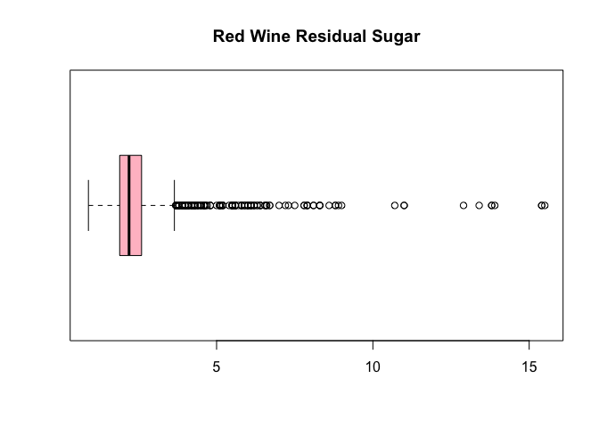
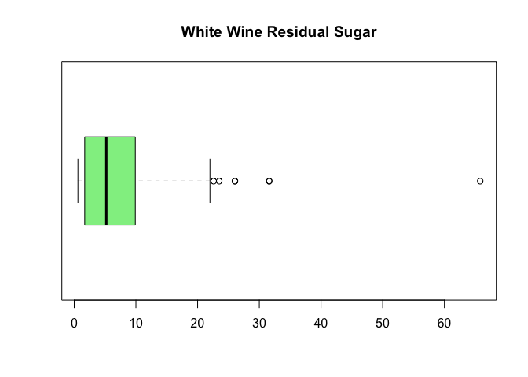
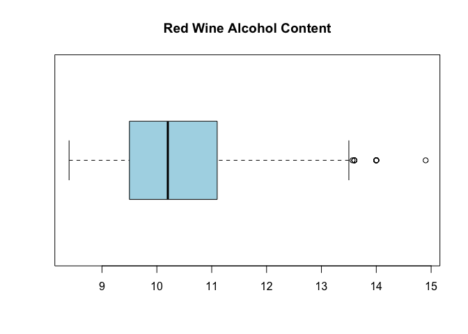
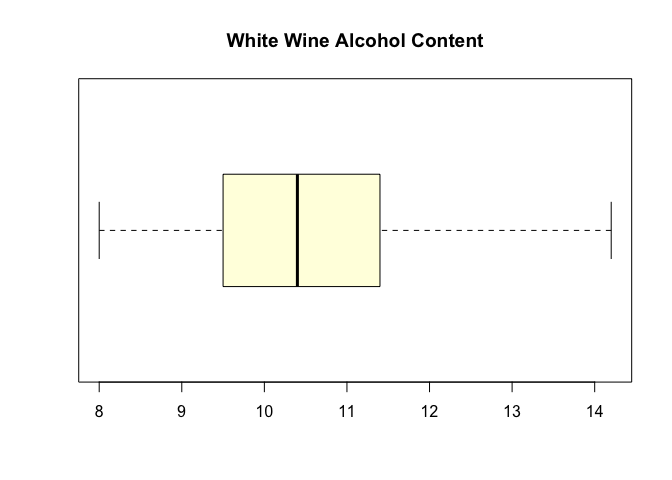
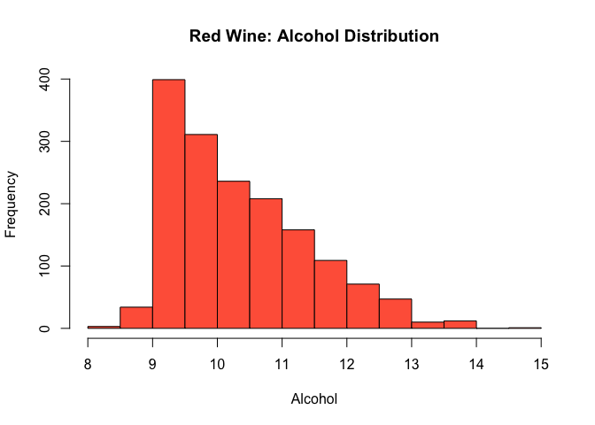
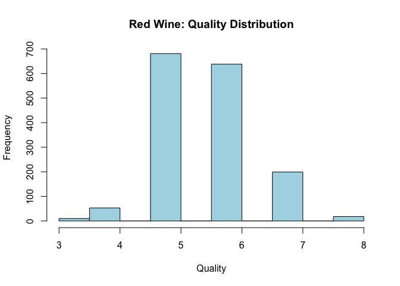

README
================

# Wine Quality Analysis

## Business Understanding

A wine producer has hired us to explore what factors most influence wine quality.  
Understanding these factors will help the producer improve the quality of their wines in future batches.

According to research, wine quality can be influenced by several characteristics, including alcohol content, acidity, sugar concentration, pH, sulfur dioxide levels, and other chemical properties.  
For example, higher alcohol content often correlates with better quality ratings, while extreme acidity or sulfur levels can negatively impact taste.

The goal of this project is to perform Exploratory Data Analysis (EDA) to discover which measurable properties are associated with better wine quality, using the UCI Wine Quality Dataset.

## Data Understanding

We are working with two datasets from the UCI Machine Learning Repository: - **Red Wine Dataset** (`winequality-red.csv`) - **White Wine Dataset** (`winequality-white.csv`)

Each dataset contains physicochemical properties of wine samples and an associated quality score.

### Number of Samples and Features

- **Red Wine**: 1,599 samples (rows) and 12 features (columns) + 1 target variable (quality).
- **White Wine**: 4,898 samples (rows) and 12 features (columns) + 1 target variable (quality).

### Feature Descriptions and Data Types

Below is a list of features included in the datasets, along with a brief description and the type of measurement:

| Feature | Description | Data Type |
|:---|:---|:---|
| Fixed Acidity | Tartaric acid content | Ratio |
| Volatile Acidity | Acetic acid content (vinegar smell) | Ratio |
| Citric Acid | Citric acid content | Ratio |
| Residual Sugar | Amount of sugar remaining after fermentation | Ratio |
| Chlorides | Amount of salt content | Ratio |
| Free Sulfur Dioxide | SO₂ forms that protect wine from microbial spoilage | Ratio |
| Total Sulfur Dioxide | Total SO₂, both free and bound forms | Ratio |
| Density | Density of the wine | Ratio |
| pH | Acidity level | Ratio |
| Sulphates | Amount of potassium sulphate (adds to wine stability) | Ratio |
| Alcohol | Percentage alcohol content | Ratio |
| Quality | Quality score between 0 and 10 | Ordinal |

- **Most features are measured on a ratio scale** (meaning they have a true zero and consistent intervals).
- **Quality** is an **ordinal variable** because it represents ordered wine ratings assigned by experts.

### Missing Values

- No missing values were found in either dataset.

## Data Preparation

Before proceeding with the exploratory data analysis, we performed some basic data preparation steps:

- **Loading the datasets**: The red and white wine datasets were successfully loaded without any issues.
- **Checking for missing values**: No missing values were found in either dataset, so no imputation was necessary.
- **Checking data types**: All features are already in numeric format, which is appropriate for the types of analysis we plan to perform (e.g., correlation, statistical testing).
- **Feature consistency**: Both datasets have the same set of features, allowing for potential combined analysis if needed.
- **Outlier detection**: Preliminary checks on variables like residual sugar and alcohol show some potential outliers. We will handle these during the EDA stage if they appear to strongly influence results.
- **No additional transformations**: Since most variables are continuous and normalized similarly, no scaling or transformations were applied at this stage.

Thus, minimal data preparation was needed. We are ready to proceed with exploratory data analysis.

------------------------------------------------------------------------

## R Markdown

This is an R Markdown document. Markdown is a simple formatting syntax for authoring HTML, PDF, and MS Word documents. For more details on using R Markdown see <http://rmarkdown.rstudio.com>.

When you click the **Knit** button a document will be generated that includes both content as well as the output of any embedded R code chunks within the document. You can embed an R code chunk like this:

``` r
# Load the red wine data
red_wine <- read.csv("winequality-red.csv", sep = ";")

# Load the white wine data
white_wine <- read.csv("winequality-white.csv", sep = ";")

# View the structure of the red wine data
str(red_wine)
```

    ## 'data.frame':    1599 obs. of  12 variables:
    ##  $ fixed.acidity       : num  7.4 7.8 7.8 11.2 7.4 7.4 7.9 7.3 7.8 7.5 ...
    ##  $ volatile.acidity    : num  0.7 0.88 0.76 0.28 0.7 0.66 0.6 0.65 0.58 0.5 ...
    ##  $ citric.acid         : num  0 0 0.04 0.56 0 0 0.06 0 0.02 0.36 ...
    ##  $ residual.sugar      : num  1.9 2.6 2.3 1.9 1.9 1.8 1.6 1.2 2 6.1 ...
    ##  $ chlorides           : num  0.076 0.098 0.092 0.075 0.076 0.075 0.069 0.065 0.073 0.071 ...
    ##  $ free.sulfur.dioxide : num  11 25 15 17 11 13 15 15 9 17 ...
    ##  $ total.sulfur.dioxide: num  34 67 54 60 34 40 59 21 18 102 ...
    ##  $ density             : num  0.998 0.997 0.997 0.998 0.998 ...
    ##  $ pH                  : num  3.51 3.2 3.26 3.16 3.51 3.51 3.3 3.39 3.36 3.35 ...
    ##  $ sulphates           : num  0.56 0.68 0.65 0.58 0.56 0.56 0.46 0.47 0.57 0.8 ...
    ##  $ alcohol             : num  9.4 9.8 9.8 9.8 9.4 9.4 9.4 10 9.5 10.5 ...
    ##  $ quality             : int  5 5 5 6 5 5 5 7 7 5 ...

``` r
# View the structure of the white wine data
str(white_wine)
```

    ## 'data.frame':    4898 obs. of  12 variables:
    ##  $ fixed.acidity       : num  7 6.3 8.1 7.2 7.2 8.1 6.2 7 6.3 8.1 ...
    ##  $ volatile.acidity    : num  0.27 0.3 0.28 0.23 0.23 0.28 0.32 0.27 0.3 0.22 ...
    ##  $ citric.acid         : num  0.36 0.34 0.4 0.32 0.32 0.4 0.16 0.36 0.34 0.43 ...
    ##  $ residual.sugar      : num  20.7 1.6 6.9 8.5 8.5 6.9 7 20.7 1.6 1.5 ...
    ##  $ chlorides           : num  0.045 0.049 0.05 0.058 0.058 0.05 0.045 0.045 0.049 0.044 ...
    ##  $ free.sulfur.dioxide : num  45 14 30 47 47 30 30 45 14 28 ...
    ##  $ total.sulfur.dioxide: num  170 132 97 186 186 97 136 170 132 129 ...
    ##  $ density             : num  1.001 0.994 0.995 0.996 0.996 ...
    ##  $ pH                  : num  3 3.3 3.26 3.19 3.19 3.26 3.18 3 3.3 3.22 ...
    ##  $ sulphates           : num  0.45 0.49 0.44 0.4 0.4 0.44 0.47 0.45 0.49 0.45 ...
    ##  $ alcohol             : num  8.8 9.5 10.1 9.9 9.9 10.1 9.6 8.8 9.5 11 ...
    ##  $ quality             : int  6 6 6 6 6 6 6 6 6 6 ...

``` r
# Number of rows and columns
dim(red_wine)   
```

    ## [1] 1599   12

``` r
dim(white_wine)
```

    ## [1] 4898   12

``` r
colnames(red_wine)
```

    ##  [1] "fixed.acidity"        "volatile.acidity"     "citric.acid"         
    ##  [4] "residual.sugar"       "chlorides"            "free.sulfur.dioxide" 
    ##  [7] "total.sulfur.dioxide" "density"              "pH"                  
    ## [10] "sulphates"            "alcohol"              "quality"

``` r
colnames(white_wine)
```

    ##  [1] "fixed.acidity"        "volatile.acidity"     "citric.acid"         
    ##  [4] "residual.sugar"       "chlorides"            "free.sulfur.dioxide" 
    ##  [7] "total.sulfur.dioxide" "density"              "pH"                  
    ## [10] "sulphates"            "alcohol"              "quality"

``` r
# Summary for red wine
summary(red_wine)
```

    ##  fixed.acidity   volatile.acidity  citric.acid    residual.sugar  
    ##  Min.   : 4.60   Min.   :0.1200   Min.   :0.000   Min.   : 0.900  
    ##  1st Qu.: 7.10   1st Qu.:0.3900   1st Qu.:0.090   1st Qu.: 1.900  
    ##  Median : 7.90   Median :0.5200   Median :0.260   Median : 2.200  
    ##  Mean   : 8.32   Mean   :0.5278   Mean   :0.271   Mean   : 2.539  
    ##  3rd Qu.: 9.20   3rd Qu.:0.6400   3rd Qu.:0.420   3rd Qu.: 2.600  
    ##  Max.   :15.90   Max.   :1.5800   Max.   :1.000   Max.   :15.500  
    ##    chlorides       free.sulfur.dioxide total.sulfur.dioxide    density      
    ##  Min.   :0.01200   Min.   : 1.00       Min.   :  6.00       Min.   :0.9901  
    ##  1st Qu.:0.07000   1st Qu.: 7.00       1st Qu.: 22.00       1st Qu.:0.9956  
    ##  Median :0.07900   Median :14.00       Median : 38.00       Median :0.9968  
    ##  Mean   :0.08747   Mean   :15.87       Mean   : 46.47       Mean   :0.9967  
    ##  3rd Qu.:0.09000   3rd Qu.:21.00       3rd Qu.: 62.00       3rd Qu.:0.9978  
    ##  Max.   :0.61100   Max.   :72.00       Max.   :289.00       Max.   :1.0037  
    ##        pH          sulphates         alcohol         quality     
    ##  Min.   :2.740   Min.   :0.3300   Min.   : 8.40   Min.   :3.000  
    ##  1st Qu.:3.210   1st Qu.:0.5500   1st Qu.: 9.50   1st Qu.:5.000  
    ##  Median :3.310   Median :0.6200   Median :10.20   Median :6.000  
    ##  Mean   :3.311   Mean   :0.6581   Mean   :10.42   Mean   :5.636  
    ##  3rd Qu.:3.400   3rd Qu.:0.7300   3rd Qu.:11.10   3rd Qu.:6.000  
    ##  Max.   :4.010   Max.   :2.0000   Max.   :14.90   Max.   :8.000

``` r
# Summary for white wine
summary(white_wine)
```

    ##  fixed.acidity    volatile.acidity  citric.acid     residual.sugar  
    ##  Min.   : 3.800   Min.   :0.0800   Min.   :0.0000   Min.   : 0.600  
    ##  1st Qu.: 6.300   1st Qu.:0.2100   1st Qu.:0.2700   1st Qu.: 1.700  
    ##  Median : 6.800   Median :0.2600   Median :0.3200   Median : 5.200  
    ##  Mean   : 6.855   Mean   :0.2782   Mean   :0.3342   Mean   : 6.391  
    ##  3rd Qu.: 7.300   3rd Qu.:0.3200   3rd Qu.:0.3900   3rd Qu.: 9.900  
    ##  Max.   :14.200   Max.   :1.1000   Max.   :1.6600   Max.   :65.800  
    ##    chlorides       free.sulfur.dioxide total.sulfur.dioxide    density      
    ##  Min.   :0.00900   Min.   :  2.00      Min.   :  9.0        Min.   :0.9871  
    ##  1st Qu.:0.03600   1st Qu.: 23.00      1st Qu.:108.0        1st Qu.:0.9917  
    ##  Median :0.04300   Median : 34.00      Median :134.0        Median :0.9937  
    ##  Mean   :0.04577   Mean   : 35.31      Mean   :138.4        Mean   :0.9940  
    ##  3rd Qu.:0.05000   3rd Qu.: 46.00      3rd Qu.:167.0        3rd Qu.:0.9961  
    ##  Max.   :0.34600   Max.   :289.00      Max.   :440.0        Max.   :1.0390  
    ##        pH          sulphates         alcohol         quality     
    ##  Min.   :2.720   Min.   :0.2200   Min.   : 8.00   Min.   :3.000  
    ##  1st Qu.:3.090   1st Qu.:0.4100   1st Qu.: 9.50   1st Qu.:5.000  
    ##  Median :3.180   Median :0.4700   Median :10.40   Median :6.000  
    ##  Mean   :3.188   Mean   :0.4898   Mean   :10.51   Mean   :5.878  
    ##  3rd Qu.:3.280   3rd Qu.:0.5500   3rd Qu.:11.40   3rd Qu.:6.000  
    ##  Max.   :3.820   Max.   :1.0800   Max.   :14.20   Max.   :9.000

``` r
# Check missing values
sum(is.na(red_wine))
```

    ## [1] 0

``` r
sum(is.na(white_wine))
```

    ## [1] 0

``` r
# Double check missing values
sum(is.na(red_wine))
```

    ## [1] 0

``` r
sum(is.na(white_wine))
```

    ## [1] 0

``` r
# Corrected boxplots using periods

# Red wine residual sugar
boxplot(red_wine$residual.sugar,
        main = "Red Wine Residual Sugar", 
        horizontal = TRUE, 
        col = "pink")
```

<!-- -->

``` r
# White wine residual sugar
boxplot(white_wine$residual.sugar,
        main = "White Wine Residual Sugar", 
        horizontal = TRUE, 
        col = "lightgreen")
```

<!-- -->

``` r
# Red wine alcohol
boxplot(red_wine$alcohol,
        main = "Red Wine Alcohol Content", 
        horizontal = TRUE, 
        col = "lightblue")
```

<!-- -->

``` r
# White wine alcohol
boxplot(white_wine$alcohol,
        main = "White Wine Alcohol Content", 
        horizontal = TRUE, 
        col = "lightyellow")
```

<!-- -->

## Including Plots

``` r
# Boxplot of Alcohol vs Quality (Red Wine)
boxplot(alcohol ~ quality, data = red_wine,
        main = "Red Wine: Alcohol Content by Quality",
        xlab = "Quality Score", ylab = "Alcohol Content",
        col = "tomato")
```

<!-- -->

``` r
# Boxplot of Alcohol vs Quality (White Wine)
boxplot(alcohol ~ quality, data = white_wine,
        main = "White Wine: Alcohol Content by Quality",
        xlab = "Quality Score", ylab = "Alcohol Content",
        col = "lightblue")
```

<!-- -->

Note that the `echo = FALSE` parameter was added to the code chunk to prevent printing of the R code that generated the plot.
