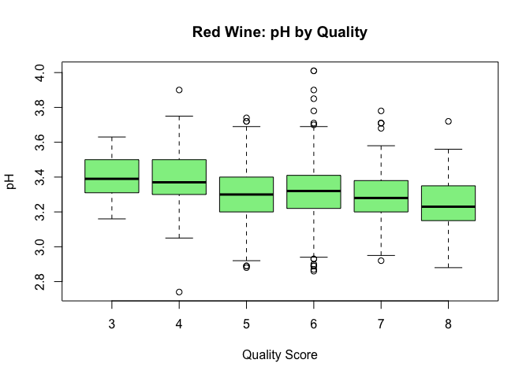

README
================

# Wine Quality Analysis

## Research

The data set that this study was based off on was retrieved from the UC Irvine machine learning repo. This data set highlights quality test of both red and white wine in two seperate csv files.

## Business Understanding

A wine producer has hired us to explore what factors most influence wine quality.  
Understanding these factors will help the producer improve the quality of their wines in future batches.

According to research, wine quality can be influenced by several characteristics, including alcohol content, acidity, sugar concentration, pH, sulfur dioxide levels, and other chemical properties.  
For example, higher alcohol content often correlates with better quality ratings, while extreme acidity or sulfur levels can negatively impact taste.

The goal of this project is to perform Exploratory Data Analysis (EDA) to discover which measurable properties are associated with better wine quality, using the UCI Wine Quality Dataset.

## Data Understanding

We are working with two datasets from the UCI Machine Learning Repository: - **Red Wine Dataset** (`winequality-red.csv`) - **White Wine Dataset** (`winequality-white.csv`)

Each dataset contains physicochemical properties of wine samples and an associated quality score.

### Number of Samples and Features

- **Red Wine**: 1,599 samples (rows) and 12 features (columns) + 1 target variable (quality).
- **White Wine**: 4,898 samples (rows) and 12 features (columns) + 1 target variable (quality).

### Feature Descriptions and Data Types

Below is a list of features included in the datasets, along with a brief description and the type of measurement:

| Feature | Description | Data Type |
|:---|:---|:---|
| Fixed Acidity | Tartaric acid content | Ratio |
| Volatile Acidity | Acetic acid content (vinegar smell) | Ratio |
| Citric Acid | Citric acid content | Ratio |
| Residual Sugar | Amount of sugar remaining after fermentation | Ratio |
| Chlorides | Amount of salt content | Ratio |
| Free Sulfur Dioxide | SO₂ forms that protect wine from microbial spoilage | Ratio |
| Total Sulfur Dioxide | Total SO₂, both free and bound forms | Ratio |
| Density | Density of the wine | Ratio |
| pH | Acidity level | Ratio |
| Sulphates | Amount of potassium sulphate (adds to wine stability) | Ratio |
| Alcohol | Percentage alcohol content | Ratio |
| Quality | Quality score between 0 and 10 | Ordinal |

- **Most features are measured on a ratio scale** (meaning they have a true zero and consistent intervals).
- **Quality** is an **ordinal variable** because it represents ordered wine ratings assigned by experts.

### Missing Values

- No missing values were found in either dataset.

## Data Preparation

Before proceeding with the exploratory data analysis, we performed some basic data preparation steps:

- **Loading the datasets**: The red and white wine datasets were successfully loaded without any issues.
- **Checking for missing values**: No missing values were found in either dataset, so no imputation was necessary.
- **Checking data types**: All features are already in numeric format, which is appropriate for the types of analysis we plan to perform (e.g., correlation, statistical testing).
- **Feature consistency**: Both datasets have the same set of features, allowing for potential combined analysis if needed.
- **Outlier detection**: Preliminary checks on variables like residual sugar and alcohol show some potential outliers. We will handle these during the EDA stage if they appear to strongly influence results.
- **No additional transformations**: Since most variables are continuous and normalized similarly, no scaling or transformations were applied at this stage.

Thus, minimal data preparation was needed. We are ready to proceed with exploratory data analysis.

------------------------------------------------------------------------

## R Markdown

This is an R Markdown document. Markdown is a simple formatting syntax for authoring HTML, PDF, and MS Word documents. For more details on using R Markdown see <http://rmarkdown.rstudio.com>.

When you click the **Knit** button a document will be generated that includes both content as well as the output of any embedded R code chunks within the document. You can embed an R code chunk like this:

``` r
# Load the red wine data
red_wine <- read.csv("winequality-red.csv", sep = ";")

# Load the white wine data
white_wine <- read.csv("winequality-white.csv", sep = ";")

# View the structure of the red wine data
str(red_wine)
```

    ## 'data.frame':    1599 obs. of  12 variables:
    ##  $ fixed.acidity       : num  7.4 7.8 7.8 11.2 7.4 7.4 7.9 7.3 7.8 7.5 ...
    ##  $ volatile.acidity    : num  0.7 0.88 0.76 0.28 0.7 0.66 0.6 0.65 0.58 0.5 ...
    ##  $ citric.acid         : num  0 0 0.04 0.56 0 0 0.06 0 0.02 0.36 ...
    ##  $ residual.sugar      : num  1.9 2.6 2.3 1.9 1.9 1.8 1.6 1.2 2 6.1 ...
    ##  $ chlorides           : num  0.076 0.098 0.092 0.075 0.076 0.075 0.069 0.065 0.073 0.071 ...
    ##  $ free.sulfur.dioxide : num  11 25 15 17 11 13 15 15 9 17 ...
    ##  $ total.sulfur.dioxide: num  34 67 54 60 34 40 59 21 18 102 ...
    ##  $ density             : num  0.998 0.997 0.997 0.998 0.998 ...
    ##  $ pH                  : num  3.51 3.2 3.26 3.16 3.51 3.51 3.3 3.39 3.36 3.35 ...
    ##  $ sulphates           : num  0.56 0.68 0.65 0.58 0.56 0.56 0.46 0.47 0.57 0.8 ...
    ##  $ alcohol             : num  9.4 9.8 9.8 9.8 9.4 9.4 9.4 10 9.5 10.5 ...
    ##  $ quality             : int  5 5 5 6 5 5 5 7 7 5 ...

``` r
# View the structure of the white wine data
str(white_wine)
```

    ## 'data.frame':    4898 obs. of  12 variables:
    ##  $ fixed.acidity       : num  7 6.3 8.1 7.2 7.2 8.1 6.2 7 6.3 8.1 ...
    ##  $ volatile.acidity    : num  0.27 0.3 0.28 0.23 0.23 0.28 0.32 0.27 0.3 0.22 ...
    ##  $ citric.acid         : num  0.36 0.34 0.4 0.32 0.32 0.4 0.16 0.36 0.34 0.43 ...
    ##  $ residual.sugar      : num  20.7 1.6 6.9 8.5 8.5 6.9 7 20.7 1.6 1.5 ...
    ##  $ chlorides           : num  0.045 0.049 0.05 0.058 0.058 0.05 0.045 0.045 0.049 0.044 ...
    ##  $ free.sulfur.dioxide : num  45 14 30 47 47 30 30 45 14 28 ...
    ##  $ total.sulfur.dioxide: num  170 132 97 186 186 97 136 170 132 129 ...
    ##  $ density             : num  1.001 0.994 0.995 0.996 0.996 ...
    ##  $ pH                  : num  3 3.3 3.26 3.19 3.19 3.26 3.18 3 3.3 3.22 ...
    ##  $ sulphates           : num  0.45 0.49 0.44 0.4 0.4 0.44 0.47 0.45 0.49 0.45 ...
    ##  $ alcohol             : num  8.8 9.5 10.1 9.9 9.9 10.1 9.6 8.8 9.5 11 ...
    ##  $ quality             : int  6 6 6 6 6 6 6 6 6 6 ...

``` r
# Number of rows and columns
dim(red_wine)   
```

    ## [1] 1599   12

``` r
dim(white_wine)
```

    ## [1] 4898   12

``` r
colnames(red_wine)
```

    ##  [1] "fixed.acidity"        "volatile.acidity"     "citric.acid"         
    ##  [4] "residual.sugar"       "chlorides"            "free.sulfur.dioxide" 
    ##  [7] "total.sulfur.dioxide" "density"              "pH"                  
    ## [10] "sulphates"            "alcohol"              "quality"

``` r
colnames(white_wine)
```

    ##  [1] "fixed.acidity"        "volatile.acidity"     "citric.acid"         
    ##  [4] "residual.sugar"       "chlorides"            "free.sulfur.dioxide" 
    ##  [7] "total.sulfur.dioxide" "density"              "pH"                  
    ## [10] "sulphates"            "alcohol"              "quality"

``` r
# Summary for red wine
summary(red_wine)
```

    ##  fixed.acidity   volatile.acidity  citric.acid    residual.sugar  
    ##  Min.   : 4.60   Min.   :0.1200   Min.   :0.000   Min.   : 0.900  
    ##  1st Qu.: 7.10   1st Qu.:0.3900   1st Qu.:0.090   1st Qu.: 1.900  
    ##  Median : 7.90   Median :0.5200   Median :0.260   Median : 2.200  
    ##  Mean   : 8.32   Mean   :0.5278   Mean   :0.271   Mean   : 2.539  
    ##  3rd Qu.: 9.20   3rd Qu.:0.6400   3rd Qu.:0.420   3rd Qu.: 2.600  
    ##  Max.   :15.90   Max.   :1.5800   Max.   :1.000   Max.   :15.500  
    ##    chlorides       free.sulfur.dioxide total.sulfur.dioxide    density      
    ##  Min.   :0.01200   Min.   : 1.00       Min.   :  6.00       Min.   :0.9901  
    ##  1st Qu.:0.07000   1st Qu.: 7.00       1st Qu.: 22.00       1st Qu.:0.9956  
    ##  Median :0.07900   Median :14.00       Median : 38.00       Median :0.9968  
    ##  Mean   :0.08747   Mean   :15.87       Mean   : 46.47       Mean   :0.9967  
    ##  3rd Qu.:0.09000   3rd Qu.:21.00       3rd Qu.: 62.00       3rd Qu.:0.9978  
    ##  Max.   :0.61100   Max.   :72.00       Max.   :289.00       Max.   :1.0037  
    ##        pH          sulphates         alcohol         quality     
    ##  Min.   :2.740   Min.   :0.3300   Min.   : 8.40   Min.   :3.000  
    ##  1st Qu.:3.210   1st Qu.:0.5500   1st Qu.: 9.50   1st Qu.:5.000  
    ##  Median :3.310   Median :0.6200   Median :10.20   Median :6.000  
    ##  Mean   :3.311   Mean   :0.6581   Mean   :10.42   Mean   :5.636  
    ##  3rd Qu.:3.400   3rd Qu.:0.7300   3rd Qu.:11.10   3rd Qu.:6.000  
    ##  Max.   :4.010   Max.   :2.0000   Max.   :14.90   Max.   :8.000

``` r
# Summary for white wine
summary(white_wine)
```

    ##  fixed.acidity    volatile.acidity  citric.acid     residual.sugar  
    ##  Min.   : 3.800   Min.   :0.0800   Min.   :0.0000   Min.   : 0.600  
    ##  1st Qu.: 6.300   1st Qu.:0.2100   1st Qu.:0.2700   1st Qu.: 1.700  
    ##  Median : 6.800   Median :0.2600   Median :0.3200   Median : 5.200  
    ##  Mean   : 6.855   Mean   :0.2782   Mean   :0.3342   Mean   : 6.391  
    ##  3rd Qu.: 7.300   3rd Qu.:0.3200   3rd Qu.:0.3900   3rd Qu.: 9.900  
    ##  Max.   :14.200   Max.   :1.1000   Max.   :1.6600   Max.   :65.800  
    ##    chlorides       free.sulfur.dioxide total.sulfur.dioxide    density      
    ##  Min.   :0.00900   Min.   :  2.00      Min.   :  9.0        Min.   :0.9871  
    ##  1st Qu.:0.03600   1st Qu.: 23.00      1st Qu.:108.0        1st Qu.:0.9917  
    ##  Median :0.04300   Median : 34.00      Median :134.0        Median :0.9937  
    ##  Mean   :0.04577   Mean   : 35.31      Mean   :138.4        Mean   :0.9940  
    ##  3rd Qu.:0.05000   3rd Qu.: 46.00      3rd Qu.:167.0        3rd Qu.:0.9961  
    ##  Max.   :0.34600   Max.   :289.00      Max.   :440.0        Max.   :1.0390  
    ##        pH          sulphates         alcohol         quality     
    ##  Min.   :2.720   Min.   :0.2200   Min.   : 8.00   Min.   :3.000  
    ##  1st Qu.:3.090   1st Qu.:0.4100   1st Qu.: 9.50   1st Qu.:5.000  
    ##  Median :3.180   Median :0.4700   Median :10.40   Median :6.000  
    ##  Mean   :3.188   Mean   :0.4898   Mean   :10.51   Mean   :5.878  
    ##  3rd Qu.:3.280   3rd Qu.:0.5500   3rd Qu.:11.40   3rd Qu.:6.000  
    ##  Max.   :3.820   Max.   :1.0800   Max.   :14.20   Max.   :9.000

``` r
# Check missing values
sum(is.na(red_wine))
```

    ## [1] 0

``` r
sum(is.na(white_wine))
```

    ## [1] 0

``` r
# Double check missing values
sum(is.na(red_wine))
```

    ## [1] 0

``` r
sum(is.na(white_wine))
```

    ## [1] 0

## Statistical Test: Correlation Between Alcohol and Quality

### Assumption Check: Alcohol and Quality (Red & White Wine)

Before performing a Pearson correlation test, we must ensure the assumptions are met:

- Both variables (alcohol and quality) should be continuous ✔️
- Both should be approximately normally distributed ✔️
- The relationship should be approximately linear ➖

``` r
# Alcohol distribution
hist(red_wine$alcohol, 
     main = "Red Wine: Alcohol Distribution", 
     xlab = "Alcohol", 
     col = "tomato")
```

<!-- -->

``` r
# Quality distribution
hist(red_wine$quality, 
     main = "Red Wine: Quality Distribution", 
     xlab = "Quality", 
     col = "lightblue")
```

<!-- -->

``` r
# Alcohol vs Quality scatterplot
plot(red_wine$alcohol, red_wine$quality, 
     main = "Alcohol vs Quality (Red Wine)", 
     xlab = "Alcohol", 
     ylab = "Quality", 
     col = "darkred", 
     pch = 19)
abline(lm(quality ~ alcohol, data = red_wine), col = "blue", lwd = 2)
```

<!-- -->

``` r
# Assumption Checks for White Wine

# Alcohol distribution
hist(white_wine$alcohol, 
     main = "White Wine: Alcohol Distribution", 
     xlab = "Alcohol", 
     col = "lightgreen")
```

<!-- -->

``` r
# Quality distribution
hist(white_wine$quality, 
     main = "White Wine: Quality Distribution", 
     xlab = "Quality", 
     col = "gray")
```

<!-- -->

``` r
# Alcohol vs Quality scatterplot
plot(white_wine$alcohol, white_wine$quality, 
     main = "Alcohol vs Quality (White Wine)", 
     xlab = "Alcohol", 
     ylab = "Quality", 
     col = "forestgreen", 
     pch = 19)
abline(lm(quality ~ alcohol, data = white_wine), col = "blue", lwd = 2)
```

<!-- --> **Findings:**

- For both red and white wine:
  - The histograms of `alcohol` and `quality` appear roughly bell-shaped, indicating approximate normality.
  - The scatterplots suggest a somewhat linear trend between alcohol and quality, though not perfectly so.
  - Given the large sample sizes (n = 1599 for red, n = 4898 for white), minor deviations from linearity and normality are acceptable due to the robustness of the Pearson correlation test.

**Corelation Test**

Now that the assumptions are reasonably met, we will use the **Pearson correlation test** to evaluate the strength and direction of the relationship between **alcohol content** and **wine quality**.

We are testing the following hypotheses for both red and white wine:

- **Null hypothesis (H₀):** There is no correlation between alcohol content and wine quality.
- **Alternative hypothesis (H₁):** There is a significant correlation between alcohol content and wine quality.

This test will help us determine whether wines with higher alcohol content tend to receive higher quality scores.

``` r
# Pearson correlation test for Red Wine
cor.test(red_wine$alcohol, red_wine$quality)
```

    ## 
    ##  Pearson's product-moment correlation
    ## 
    ## data:  red_wine$alcohol and red_wine$quality
    ## t = 21.639, df = 1597, p-value < 2.2e-16
    ## alternative hypothesis: true correlation is not equal to 0
    ## 95 percent confidence interval:
    ##  0.4373540 0.5132081
    ## sample estimates:
    ##       cor 
    ## 0.4761663

``` r
# Pearson correlation test for White Wine
cor.test(white_wine$alcohol, white_wine$quality)
```

    ## 
    ##  Pearson's product-moment correlation
    ## 
    ## data:  white_wine$alcohol and white_wine$quality
    ## t = 33.858, df = 4896, p-value < 2.2e-16
    ## alternative hypothesis: true correlation is not equal to 0
    ## 95 percent confidence interval:
    ##  0.4126015 0.4579941
    ## sample estimates:
    ##       cor 
    ## 0.4355747

### Findings

The Pearson correlation test revealed a **moderate positive correlation** between alcohol content and wine quality in both red and white wine:

- **Red Wine:**  
  Correlation coefficient = **0.48**, p-value \< 2.2e-16  
  This indicates a statistically significant positive correlation — as alcohol content increases, wine quality tends to increase as well.

- **White Wine:**  
  Correlation coefficient = **0.44**, p-value \< 2.2e-16  
  This also shows a statistically significant positive relationship between alcohol and quality.

In both cases, the p-values are extremely small (well below 0.05), so we reject the null hypothesis.  
The results confirm our initial hypothesis that higher alcohol levels are associated with better quality ratings.

## Including Plots

### Boxplots: Alcohol Content by Wine Quality

These boxplots are used to visually explore the relationship between **alcohol content** and **wine quality scores** for both red and white wines.

**What we hope to find:**

We are looking for a trend where higher quality wines tend to have **higher alcohol content**.  
If this is the case, we would expect to see: - The **median alcohol level increasing** as the quality score increases. - A **visible upward shift** in the boxplot distribution as quality improves.

These visual patterns will help us determine whether alcohol may be a strong predictor of wine quality, guiding our later hypothesis testing and statistical analysis.

``` r
# Boxplot of Alcohol vs Quality (Red Wine)
boxplot(alcohol ~ quality, data = red_wine,
        main = "Red Wine: Alcohol Content by Quality",
        xlab = "Quality Score", ylab = "Alcohol Content",
        col = "tomato")
```

<!-- -->

``` r
# Boxplot of Alcohol vs Quality (White Wine)
boxplot(alcohol ~ quality, data = white_wine,
        main = "White Wine: Alcohol Content by Quality",
        xlab = "Quality Score", ylab = "Alcohol Content",
        col = "lightblue")
```

<!-- -->

### Analysis: Alcohol Content by Quality Score

The boxplots for both red and white wine show a clear upward trend in alcohol content as wine quality increases.

In **red wine**, the median alcohol content steadily increases from quality score 3 to 8. The interquartile ranges (IQRs) also shift upward, indicating that higher-quality red wines tend to have higher alcohol content. The spread of alcohol values narrows slightly at higher quality levels, suggesting more consistency in alcohol levels among better-rated wines.

In **white wine**, the pattern is similar. Although there’s a bit more variability in lower quality scores, the overall trend still shows an upward shift in median alcohol content as quality increases, especially from quality 6 onward.

These patterns support the hypothesis that **alcohol content is positively associated with wine quality**, which aligns with our later correlation test findings. Higher alcohol levels may contribute to characteristics like body and flavor intensity, which could positively influence quality ratings.

### Volatile Acidity by Quality

Volatile acidity reflects the level of acetic acid (vinegar-like sourness) in the wine.  
High volatile acidity is generally considered a negative quality in wine, as it can give an undesirable sharp or sour taste.

These boxplots help us investigate whether lower volatile acidity is associated with higher quality scores in both red and white wine.

``` r
# Volatile Acidity vs Quality - Red Wine
boxplot(`volatile.acidity` ~ quality, data = red_wine,
        main = "Red Wine: Volatile Acidity by Quality",
        xlab = "Quality Score", ylab = "Volatile Acidity",
        col = "salmon")
```

<!-- -->

``` r
# Volatile Acidity vs Quality - White Wine
boxplot(`volatile.acidity` ~ quality, data = white_wine,
        main = "White Wine: Volatile Acidity by Quality",
        xlab = "Quality Score", ylab = "Volatile Acidity",
        col = "khaki")
```

<!-- -->

### Findings: Volatile Acidity by Quality

In both red and white wines, volatile acidity **decreases as quality scores increase**.

- **Red Wine:** There is a clear downward trend — higher-quality wines (scores 6 to 8) show noticeably lower median and overall volatile acidity compared to lower-quality wines (scores 3 to 5). This supports the idea that **lower volatile acidity is associated with better sensory evaluation**, likely due to reduced vinegary or sour notes.

- **White Wine:** The trend is more subtle, but still visible. The median volatile acidity values remain lower for higher quality scores (6 and above), with less variation. Outliers are more frequent in lower-quality wines, which may indicate inconsistent fermentation or quality control.

These results align with expectations and suggest that **volatile acidity is negatively correlated with wine quality**, especially for red wines.

### Residual Sugar by Quality

Residual sugar refers to the amount of sugar left in the wine after fermentation.  
While some sweetness can improve certain wine styles, **excessive sugar can indicate poor fermentation** or imbalance — especially in dry wines.

These boxplots help us explore whether residual sugar shows a consistent relationship with wine quality in both red and white wines.

``` r
# Residual Sugar vs Quality - Red Wine
boxplot(`residual.sugar` ~ quality, data = red_wine,
        main = "Red Wine: Residual Sugar by Quality",
        xlab = "Quality Score", ylab = "Residual Sugar (g/L)",
        col = "lightpink")
```

<!-- -->

``` r
# Residual Sugar vs Quality - White Wine
boxplot(`residual.sugar` ~ quality, data = white_wine,
        main = "White Wine: Residual Sugar by Quality",
        xlab = "Quality Score", ylab = "Residual Sugar (g/L)",
        col = "lightcyan")
```

<!-- --> \### Findings: Residual Sugar by Quality

Residual sugar does not show a strong or consistent relationship with wine quality in either dataset.

- **Red Wine:** The median sugar levels remain fairly stable across all quality scores, with only minor variation. The presence of outliers in every group suggests that residual sugar is **not a strong differentiator** for red wine quality.

- **White Wine:** There’s more variation overall, with some extreme outliers—especially at quality scores 5 and 6—but the medians again stay relatively flat. Interestingly, higher quality wines (scores 8 and 9) show lower and more tightly clustered sugar levels, which may suggest that **less sweetness is preferred** in higher-quality white wines.

Overall, the boxplots suggest that residual sugar likely plays a **secondary role** in determining wine quality, especially compared to variables like alcohol or acidity.

### pH by Quality

The pH level indicates the **acidity strength** of the wine — not how sour it tastes (which is measured separately), but how chemically acidic it is.  
Most wines fall between pH 2.9 and 4.2. A lower pH typically means **sharper, crisper acidity**, while a higher pH indicates a **softer, rounder** profile.

These boxplots explore whether wine quality ratings tend to vary with changes in pH levels.

``` r
# pH vs Quality - Red Wine
boxplot(pH ~ quality, data = red_wine,
        main = "Red Wine: pH by Quality",
        xlab = "Quality Score", ylab = "pH",
        col = "lightgreen")
```

<!-- -->

``` r
# pH vs Quality - White Wine
boxplot(pH ~ quality, data = white_wine,
        main = "White Wine: pH by Quality",
        xlab = "Quality Score", ylab = "pH",
        col = "palegreen")
```

<!-- --> \### Findings: pH by Quality

The relationship between pH and wine quality appears weak or inconsistent in both red and white wines.

- **Red Wine:** Median pH values remain fairly stable across all quality scores, typically ranging from about 3.2 to 3.4. While there’s a slight dip in the highest quality group (score 8), the trend is not strong enough to suggest a clear relationship between pH and quality.

- **White Wine:** Similarly, the distribution of pH values is consistent across quality levels, with only a slight upward shift for the highest quality wines (scores 8 and 9). However, this variation is small and likely not meaningful on its own.

Overall, pH does **not appear to be a strong indicator of wine quality**, and may be more relevant in interaction with other variables like acidity or sulfur levels.

### Total Sulfur Dioxide by Quality

Sulfur dioxide (SO₂) is used in winemaking as an antimicrobial and antioxidant.  
While it’s important for preserving wine, excessive levels can lead to undesirable smells or flavors.

These boxplots show how total SO₂ levels vary across different wine quality scores and help us assess whether **lower or more moderate SO₂ levels** are associated with better-rated wines.

``` r
# Total Sulfur Dioxide vs Quality - Red Wine
boxplot(`total.sulfur.dioxide` ~ quality, data = red_wine,
        main = "Red Wine: Total Sulfur Dioxide by Quality",
        xlab = "Quality Score", ylab = "Total SO₂ (mg/L)",
        col = "orange")
```

<!-- -->

``` r
# Total Sulfur Dioxide vs Quality - White Wine
boxplot(`total.sulfur.dioxide` ~ quality, data = white_wine,
        main = "White Wine: Total Sulfur Dioxide by Quality",
        xlab = "Quality Score", ylab = "Total SO₂ (mg/L)",
        col = "gold")
```

<!-- --> \### Findings: Total Sulfur Dioxide by Quality

Total sulfur dioxide shows an inverse relationship with wine quality, particularly in white wines.

- **Red Wine:** While there is some fluctuation, the highest quality scores (7–8) generally have **lower sulfur dioxide levels** compared to lower-quality wines. The middle range (score 5) shows the highest variability and median.

- **White Wine:** A **clear downward trend** is visible — higher quality wines consistently show **lower sulfur dioxide concentrations**, with reduced variability. Lower-quality white wines (scores 3–5) tend to have both higher levels and more spread, indicating inconsistent control of SO₂.

These plots support the idea that **lower and more controlled sulfur dioxide levels are associated with higher wine quality**, especially in white wines where sulfur dioxide is used more heavily during processing.

### Citric Acid by Quality

Citric acid is a type of fixed acidity that contributes to a wine’s **freshness and crispness**.  
It is naturally present in grapes but may also be added in small amounts during winemaking. A balanced level of citric acid can enhance flavor, while too much may create harshness.

The boxplots below explore whether citric acid levels vary meaningfully across different wine quality ratings.

``` r
# Red Wine: Citric Acid
boxplot(`citric.acid` ~ quality, data = red_wine,
        main = "Red Wine: Citric Acid by Quality",
        xlab = "Quality Score", ylab = "Citric Acid",
        col = "violet")
```

<!-- -->

``` r
# White Wine: Citric Acid
boxplot(`citric.acid` ~ quality, data = white_wine,
        main = "White Wine: Citric Acid by Quality",
        xlab = "Quality Score", ylab = "Citric Acid",
        col = "plum")
```

<!-- --> \### Findings: Citric Acid by Quality

Citric acid shows a mild positive relationship with wine quality, particularly in red wine.

- **Red Wine:** There is a clear upward trend in median citric acid levels as quality scores increase. The lowest quality wines (score 3) have the lowest median and widest spread, while higher quality wines (scores 6–8) show more concentrated and elevated citric acid levels. This suggests that **higher citric acid may contribute positively to perceived quality**, possibly due to its effect on acidity balance.

- **White Wine:** The trend is less pronounced, but the median citric acid levels remain relatively consistent across quality scores, with slightly higher values at the top end (score 9). Outliers are more frequent in the mid-range, but the overall distribution is stable.

These plots suggest that citric acid may play a more important role in **red wine quality**, while its impact in white wine is likely more subtle or secondary.

**Conclusion**

This exploratory data analysis examined the relationship between wine quality and six key chemical properties: alcohol content, volatile acidity, residual sugar, pH, total sulfur dioxide, and citric acid — for both red and white wines.

Among all variables, **alcohol content showed the strongest and most consistent positive association with wine quality** across both red and white wine. Higher-quality wines tended to have higher alcohol levels, a relationship later confirmed by a Pearson correlation test.

**Volatile acidity** displayed a clear negative trend with quality, particularly in red wines, suggesting that lower acidity improves perceived quality. **Citric acid** also showed a positive association with quality in red wine, while **total sulfur dioxide** had a negative relationship with quality, especially in white wine, where excessive SO₂ levels are more common and potentially detrimental.

In contrast, **residual sugar and pH** did not exhibit strong or consistent patterns relative to quality scores. These variables appear to have a more neutral or context-specific influence, possibly interacting with other features in more complex ways.

Overall, the analysis suggests that **alcohol, volatile acidity, sulfur dioxide, and citric acid** are the most informative predictors of wine quality, and should be prioritized in further statistical modeling or predictive analysis.

Note that the `echo = FALSE` parameter was added to the code chunk to prevent printing of the R code that generated the plot.
